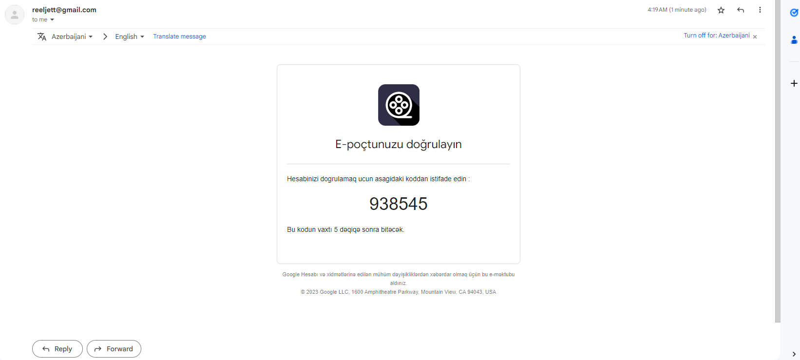
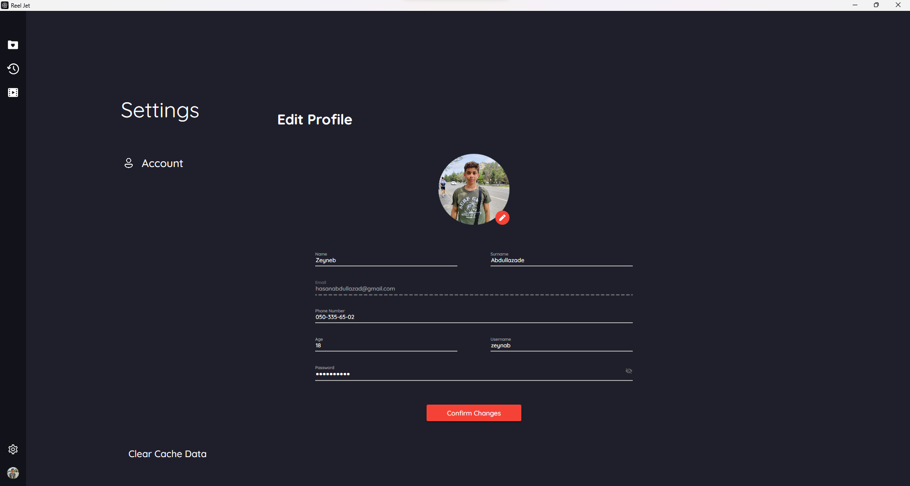

# Reel Jet

****
NOTE
If you want to work you must change ReelJet.Application/bin/debug/net6.0/databasesettings.json/your connection string.

ReelJet is a movie streaming app written on C# WPF.
Program have a robust and developed stay login system. Program can save you cache datas and you can delete them;
Program begins with the simple loading animation. Note : This program has f11 mode if you press f11 program 
will be fullscreen then if you press again it program will be in normal case.

As a user , you can create an account or login to your existing account. 

Registration contains SMTP mail sending to authanticate the user.

Email Side :

Once you're done with autharization , there will be list of movies where you can search
any movie you want.

You can click o any movie you're interested .That's where Movie Preview Page will come out .
In this page , you can learn everything about this movie . 

Or you can add it to your watchlist and watch it later

If you want to watch the movie click the Watch Movie button and movie will be opened. You can choose
Player site language subtitle and fragman from the options

You can watch movie in fullscreen but there is one problem if you need to come back to vide player
page you need click start button and the press escape key from keyboard.

After watching movie it will be stored on your watch history and you will be able to continue
watching.

Navbar: the main navbar contains watchlist,history,movie list,settings and Account and depends on which page you're currently in.

If you want to edit your personal information , click on MyAccount button from navbar.

If you want to see settings of this app ,click on Settings button from navbar.

If you have new movie you can add this movie to for you page.

If you want add your movie you must add from settings from upload video.

You can filter movies from movie list page.

You can change database from servers section.

You can change program language from RegistrationPages and settings between azerbaijani and english.

You can delete cache datas and logout. Deleting cache datas delete your historylists from web and block recommendations.
Deleting cache datas can give you big amount of empty disk space (50-70)mb.

If you have any questions or need further assistance, please don't hesitate to contact us.

Contact Email: hasanabdullazad@gmail.com
Contact Email: rustamh2006@gmail.com
